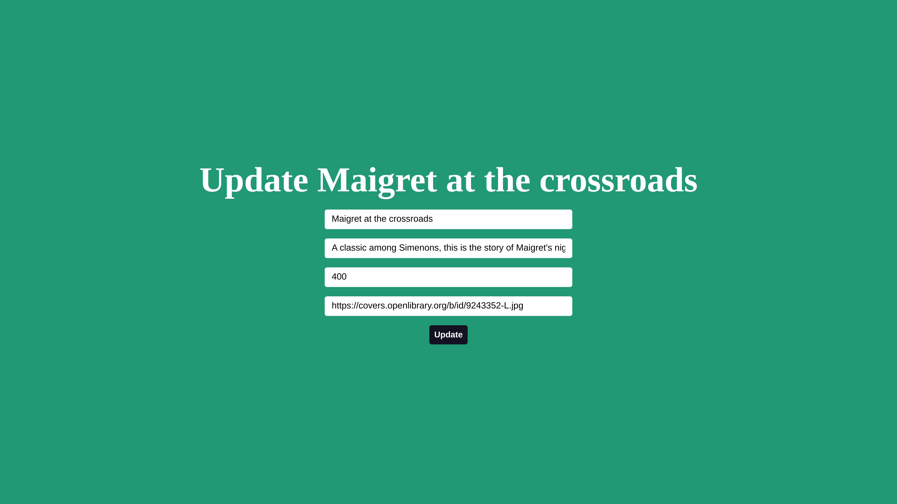

# BoiGhor
A full stack Book Store web app using React, Express, MySQL and NodeJs. This projcet demonstrate the CRUD(Create, Read, Update, and Delete) operation on a FullStack React app.

## App home page.

## New book Entry.

-----
**After entry:**

## Update Book Reocerd

----
**After updating price..**

----

## To Run the app.

1. Clone the repo.
   
   `git clone https://github.com/devjunaeid/BoiGhor.git`
2. Open up sql-workbench and run the sql command provided in `db.sql` file.
3. To configue MySQL go to `server/index.js` and give your sql-workbench username `user:`(default `root`) and `password`.
4. Go to the `client` and `server` folder and run `npm init` and then `npm start` to start the app in `localhost:3000`
